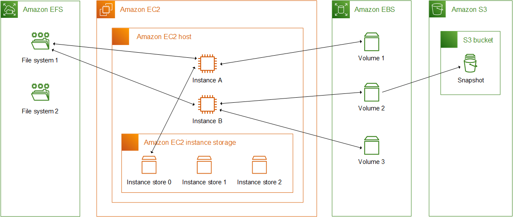

Week 2: Compute Services - Comprehensive Notes

📌 Core Concepts

1. **Amazon EC2 (Elastic Compute Cloud)**

Virtual servers in the cloud that you can rent and configure.

Key Components:

    Instance Types: Optimized for different workloads

        t series: Burstable general purpose

        m series: General purpose

        c series: Compute optimized

        r series: Memory optimized

        g series: GPU instances

Instance Lifecycle:

Launch → Running → Stop/Start → Terminate

2. **EC2 Storage Options**

EBS (Elastic Block Store)

    Network-attached storage

    Persistent (survives instance termination)

    Snapshot capability for backups

    Types: gp2/gp3 (general), io1/io2 (provisioned IOPS)

Instance Store

    Physically attached to host

    Ephemeral (lost on instance stop/terminate)

    Higher performance for temporary data

3. **AWS Lambda**

Serverless compute service that runs code in response to events.

    No servers to manage

    Pay per execution (100ms increments)

    Automatic scaling

    Stateless by design

Common Use Cases:

    File processing (S3 triggers)

    Real-time data processing

    Backend APIs (with API Gateway)

    Scheduled tasks (CloudWatch Events)

4. **Elastic Beanstalk**

Platform-as-a-Service (PaaS) that automatically handles deployment, scaling, and infrastructure.

    Deploy code without infrastructure knowledge

    Supports multiple languages

    Still uses EC2 under the hood

vs EC2:

EC2: You manage everything (IaaS)
Elastic Beanstalk: AWS manages infrastructure (PaaS)

5. **Auto Scaling & Load Balancing**

ELB (Elastic Load Balancer)

    Distributes traffic across multiple targets

    Types:

        ALB: Application Load Balancer (Layer 7)

        NLB: Network Load Balancer (Layer 4)

        CLB: Classic Load Balancer (legacy)

Auto Scaling

    Automatically adjusts number of EC2 instances

    Based on metrics (CPU, memory, custom)

    Components:

        Launch Configuration/Template

        Auto Scaling Group

        Scaling Policies

🔧 Hands-On Labs Guide

Day 8: EC2 Fundamentals Lab
bash

# SSH Connection Example

ssh -i your-key.pem ec2-user@your-ec2-public-ip

# Key Steps:

1. Choose AMI (Amazon Linux 2)
2. Select instance type (t2.micro for free tier)
3. Configure security group (allow SSH port 22)
4. Launch with new/existing key pair

Day 9: EBS Storage Lab

    Diagram:

    [EC2 Instance] ←→ [EBS Volume]
         ↑
         │
    [Security Group] ←→ [Internet Gateway]

    

Steps:

    Launch EC2 instance

    Create new EBS volume (10GB gp3)

    Attach to running instance

    SSH into instance and format/mount:

bash

sudo mkfs -t xfs /dev/xvdf
sudo mkdir /data
sudo mount /dev/xvdf /data

    Take snapshot for backup

Day 10: Lambda "Hello World"

Python Lambda Code:
python

import json

def lambda_handler(event, context):
    name = event.get('name', 'World')
    return {
        'statusCode': 200,
        'body': json.dumps(f'Hello {name}!')
    }

Test Event:
json

{
  "name": "AWS Learner"
}

Day 11: Elastic Beanstalk Deployment

Simple Flask App for EB:
python

# application.py

from flask import Flask
application = Flask(__name__)

@application.route('/')
def hello():
    return 'Hello from Elastic Beanstalk!'

if __name__ == '__main__':
    application.run()

Requirements.txt:

Flask==2.3.0

Day 12: Load Balancer + Auto Scaling

Architecture:

Internet → Application Load Balancer → Auto Scaling Group → EC2 Instances (2-5)
                                                              ↓
                                                         Target Group

Scaling Policy Example:

    Scale out when CPU > 70% for 5 minutes

    Scale in when CPU < 30% for 10 minutes

🚀 Project: Deploy Web App on EC2 with Load Balancer
Step 1: Web Application Code

Simple Node.js App:
javascript

// app.js
const express = require('express');
const app = express();
const port = 3000;

app.get('/', (req, res) => {
    const instanceId = process.env.INSTANCE_ID || 'unknown';
    res.send(`
        <h1>Welcome to AWS Week 2 Project!</h1>
        
Served from instance: ${instanceId}

        
Current time: ${new Date().toISOString()}

    `);
});

app.listen(port, () => {
    console.log(`App listening at http://localhost:${port}`);
});

Step 2: Launch EC2 Instances

    Create Launch Template:

        AMI: Amazon Linux 2

        Instance type: t2.micro

        User data script:

bash

#!/bin/bash
yum update -y
curl -sL https://rpm.nodesource.com/setup_14.x | bash -
yum install -y nodejs git
git clone https://github.com/your-repo/web-app.git
cd web-app
npm install
INSTANCE_ID=$(curl -s http://169.254.169.254/latest/meta-data/instance-id) node app.js

Step 3: Configure Load Balancer

    Create Target Group:

        Port: 3000

        Health check: / on port 3000

    Create Application Load Balancer:

        Internet-facing

        Listen on HTTP port 80

        Forward to target group

Step 4: Configure Auto Scaling

    Create Auto Scaling Group:

        Min: 2 instances

        Desired: 2 instances

        Max: 5 instances

        Subnets: Multiple AZs

    Add Scaling Policies:

        Target tracking: 70% CPU utilization

        Add CloudWatch alarms

Step 5: Test the Setup

    Get ALB DNS name

    Access in browser

    Refresh to see different instance IDs

    Simulate load (optional) to trigger scaling

## 🎯 Learning Objectives Check

- [ ] Can launch and configure EC2 instances**
- [ ] Can explain EC2 instance types
- [ ] Can create Lambda function from scratch
- [ ] Can configure Auto Scaling
- [ ] Can troubleshoot SSH connection issues