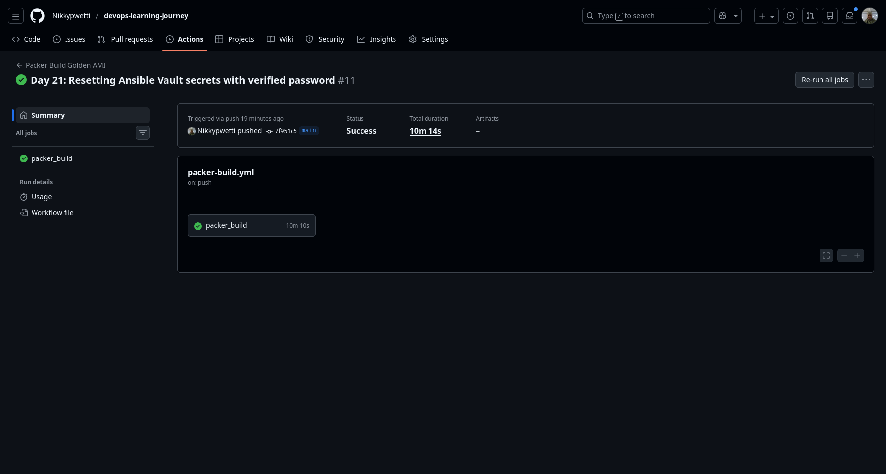
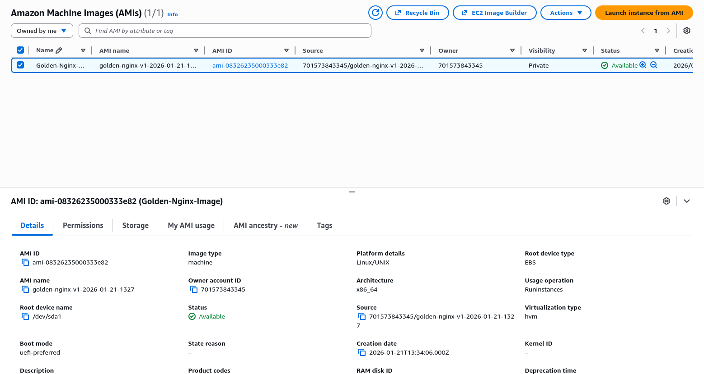
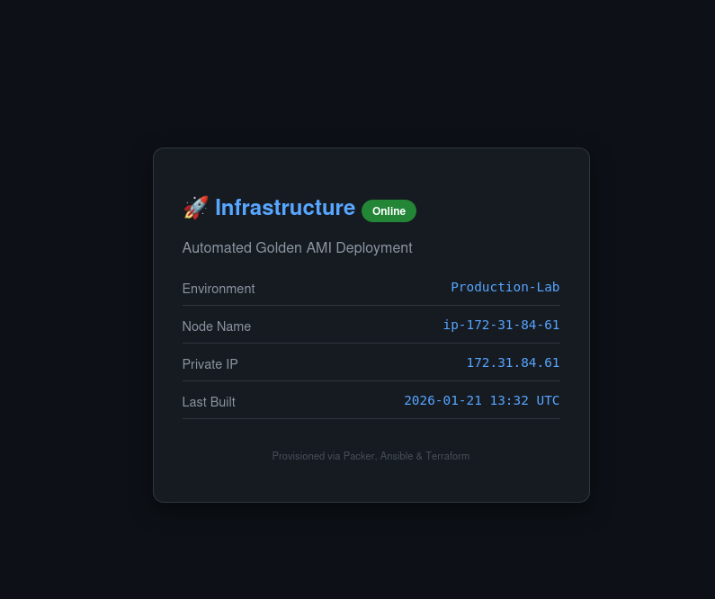
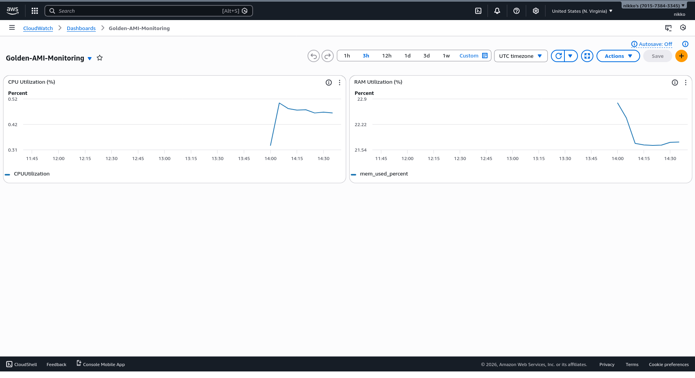
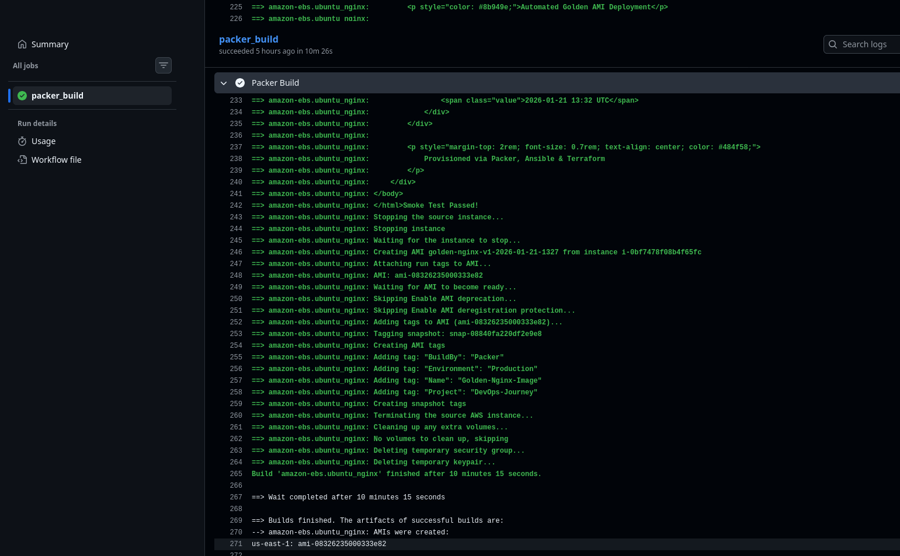

# 🛡️ Automated Golden AMI Pipeline

 

---

### 🛠️ Built With

   

A professional-grade DevOps project implementing Immutable Infrastructure and CI/CD patterns to automate the lifecycle of secure, monitored Amazon Machine Images (AMIs).

## 📋 Project Overview

This project automates the transition from raw code to a live, production-ready environment. By "baking" configurations into a Golden AMI, we reduce deployment time, ensure environment parity, and increase security.

## 🏗️ Key Architecture Phases:

    Configuration Management (Ansible): Hardening the OS, installing Nginx, and managing encrypted secrets via Ansible Vault.

    Image Factory (Packer): Automated provisioning of a temporary AWS instance to "bake" the configuration into a versioned AMI.

    CI/CD Orchestration (GitHub Actions): Fully automated pipeline that triggers on code push, handling complex pathing and secret injection.

    Infrastructure as Code (Terraform): Dynamic deployment of the Golden AMI, including IAM roles, security groups, and automated monitoring.

## 🛠️ Technology Stack

    Orchestration: GitHub Actions

    Imaging: HashiCorp Packer

    Configuration: Ansible (Jinja2 Templates & Vault)

    IaC: Terraform

    Security: IAM Instance Profiles, Security Group dynamic IP white-listing

    Monitoring: CloudWatch Dashboards & SNS Alarms

    Scripting: Bash (Dynamic IP Management)

## 🔒 Advanced Security Features

    Encrypted Secrets: Utilized Ansible Vault to secure sensitive data (Database credentials) within the repository.

    Least Privilege: Designed IAM Roles and Instance Profiles to allow EC2 instances to communicate with CloudWatch and SSM without using long-lived credentials.

    Dynamic Access Control: Developed a custom Bash script to update Terraform security group rules to only allow SSH access from the developer’s current public IP address.

## 📊 Monitoring & Observability

The project includes a self-deploying monitoring stack:

    Custom Dashboards: Real-time visualization of CPU and RAM (Memory) utilization via the CloudWatch Agent.

    Automated Alarms: SNS (Simple Notification Service) integration that sends email alerts if the instance experiences high CPU load (>80%).

### 🚀 Deployment Guide

1. Build the Golden AMI

Commit and push changes to the main branch. GitHub Actions will automate the Packer build.
Bash

# Example commit to trigger pipeline
git add .
git commit -m "feat: updated nginx configuration"
git push origin main

2. Configure Local Access

Run the dynamic IP script to authorize your current machine:
Bash

cd terraform/
chmod +x update_ip.sh
./update_ip.sh

3. Deploy Infrastructure
Bash

terraform init
terraform apply -auto-approve

## 🏁 Key Accomplishments

    Automated Cleanup: Configured Packer with force_deregister and force_delete_snapshot to maintain a clean AWS environment.

    Artifact Traceability: Implemented a Deployment Timestamp in the web application UI to track AMI versioning.

    Cross-Tool Integration: Successfully integrated Packer variables with Terraform data sources to fetch the most_recent AMI dynamically.

## 💡 Potential Enhancements

    Implementing an Auto Scaling Group (ASG) to use the Golden AMI for self-healing.

    Adding a Load Balancer (ALB) to distribute traffic across multiple instances.

## Challenges Overcome

    Debugged Ansible Vault decryption within a GitHub Actions runner.

    Managed IAM Roles to allow custom CloudWatch metrics for Memory (RAM) tracking.

    Automated AMI lifecycle management using Packer's force-deregister features.

### 📊 Project Proof of Work

| CI/CD Pipeline Success | AWS AMI Artifact |
|:---:|:---:|
|  |  |

| Live Infrastructure UI | CloudWatch Monitoring |
|:---:|:---:|
|  |  |

| Technical Build Logs |
|:---:|
|  |

## 📄 License

This project is licensed under the MIT License. You are free to use, modify, and distribute this code for personal or commercial projects, provided that the original copyright notice and this permission notice are included.
