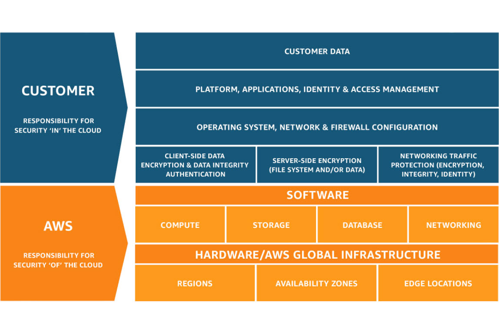

### 🎯 Today's Focus

- [X] Cloud Computing Fundamentals
- [x] Set up DevOps learning GitHub repository
- [x] Understand cloud computing concepts
- [x] Create AWS Free Tier account
- [X] Explore AWS Management Console

### 📖 What I Learned

1. **Cloud Computing Fundamentals**

   - Introduction - history of AWS [In 2006, Amazon Web Services (AWS) began offering IT infrastructure services to businesses as web services—now commonly known as cloud computing. One of the key benefits of cloud computing is the opportunity to replace upfront capital infrastructure expenses with low variable costs that scale with your business. ]

   - 📌 What is Cloud Computing?

   - Cloud computing is the on-demand delivery of IT resources over the internet with pay-as-you-go pricing. Instead of buying, owning, and maintaining physical data centers, you access technology services like computing power, storage, and databases from a cloud provider like AWS.

   - Cloud computing provides a simple way to access servers, storage, databases and a broad set of application services over the internet.

   - Key Characteristics:

    On-demand self-service: Provision resources without human interaction

    Broad network access: Access over the internet from any device

    Resource pooling: Multi-tenant model serving multiple customers

    Rapid elasticity: Scale up/down automatically

    Measured service: Pay only for what you use

    - Six advantages of cloud computing: Trade capital expense for variable expense, Benefit from massive economies of scale, Stop guessing capacity, Increase speed and agility, Stop spending money on running and maintaining data centers, Go global in minutes

    - Deployment models: Public, Private, Hybrid clouds

    - Cloud service models: IaaS, PaaS, SaaS

2. **AWS Global Infrastructure**

   - Regions: Geographic areas (e.g., us-east-1, eu-west-1)
   - Availability Zones: Isolated locations within regions
   - Edge Locations: Sites for CloudFront (CDN) - faster content delivery

3. **GitHub for Learning Documentation**

   - Created structured repository for DevOps journey
   - Set up progress tracking with README.md
   - Organized monthly learning paths

4. **AWS Shared Responsibility Model**

   - AWS Responsibility: Security OF the cloud (infrastructure)

   - Customer Responsibility: Security IN the cloud (your data, configurations)

   - Diagram:

      ```plaintext
      +----------------------+----------------------+
      |   Customer's        |      AWS's          |
      |   Responsibility    |   Responsibility    |
      +----------------------+----------------------+
      | Data                | Compute             |
      | Applications        | Storage             |
      | Operating Systems   | Networking          |
      | Network & Firewall  | Hardware            |
      +----------------------+----------------------+
      ```

      .

5. **AWS Cloud Services Overview**

   - Compute: EC2, Lambda
   - Storage: S3, EBS
   - Databases: RDS, DynamoDB
   - Networking: VPC, Route 53

### 💻 Hands-on Practice

```bash
# Created GitHub repository structure
mkdir -p 01-cloud-foundations/{study-notes,code-labs,cheatsheets}
mkdir -p projects/month1-static-website

# Pro Tip: Make any env i wanted to work with my default
export AWS_PROFILE=practice
export AWS_PROFILE=learning

# AWS CLI setup (if done)
aws configure 
for first account(A): aws sts get-caller-identity --profile practice (Niikky_Techies)
for second account(B): aws sts get-caller-identity --profile learning (nikko)
AWS Access Key ID [None]: ****************
AWS Secret Access Key [None]: ****************
Default region name [None]: us-east-1