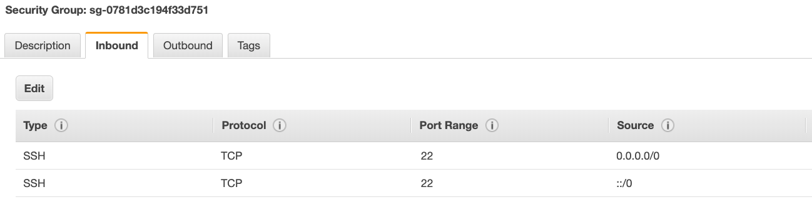

# Daily Learning Log

## Date: 2025-11-29

### 🎯 Today's Focus
- [X]  EC2 INSTANCE
- [ ] Topic 2  
- [ ] Hands-on lab

### 📖 What I Learned

1. **SSH TROUBLESHOOTING**

   - There's a connection timeout:

      . This is a security group issue. Any timeout (not just for SSH) is related to security groups or a firewall.Ensure your security group looks like this and correctly assigned to your EC2 instance.
      .

   - There's still a connection timeout issue:

      . If your security group is properly configured as above, and you still have connection timeout issues, then that means a corporate firewall or a personal firewall is blocking the connection. Please use EC2 Instance Connect as described in the next lecture.

   - SSH does not work on Windows:

      . If it says: ssh command not found, that means you have to use Putty

      . Follow again the video. If things don't work, please use EC2 Instance Connect as described in the next lecture

   - There's a connection refused:

      . This means the instance is reachable, but no SSH utility is running on the instance

      . Try to restart the instance

      . If it doesn't work, terminate the instance and create a new one. Make sure you're using Amazon Linux 2

   - Permission denied (publickey,gssapi-keyex,gssapi-with-mic)

      . This means either two things:

          . You are using the wrong security key or not using a security key. Please look at your EC2 instance configuration to make sure you have assigned the correct key to it.

          . You are using the wrong user. Make sure you have started an Amazon Linux 2 EC2 instance, and make sure you're using the user ec2-user. This is something you specify when doing ec2-user@<public-ip> (ex: ec2-user@35.180.242.162) in your SSH command or your Putty configuration.

   - Nothing is working - "aaaahhhhhh"

      . Don't panic. Use EC2 Instance Connect from the next lecture. Make sure you started an Amazon Linux 2 and you will be able to follow along with the tutorial.

   - I was able to connect yesterday, but today I can't:

      . This is probably because you have stopped your EC2 instance and then started it again today. When you do so, the public IP of your EC2 instance will change. Therefore, in your command, or Putty configuration, please make sure to edit and save the new public IP.

2. **EC2 INSTANCE CONNECT**

   - So i will click on my instance, then i will click on Connect on the top.

   - Use the Default option "Connect using EC2 Instance Connect", so i will click on connect and it's going to open a new tab And very quickly you are into your Amazon Linux 2 AMI. and i can run some commands.

   - So if I go, for example, to my Instance look at the security group and I want to edit the rules. So I click on my security group in here, the inbound rules I'm going to edit them and I'm going to remove the SSH inbound rules.

   - So I delete it and save the rules and then go back to my EC2 Instances and I close this one and I'll try to establish a new EC2 Instance Connect So let's connect, as you can see, this is not working because while there's a problem connected to your Instance.

   - So back into my launch wizard, I can fix this. I will edit the inbound rule, add the SSH rule from anywhere IPV4, save the rule. Let's go back in here and just in case, if it doesn't work for you, sometimes it's because you're using IPV6, So therefore you need to do from anywhere IPV6 as well.

   - So you need to add these two entries for your EC2 Instance Connect to work sometimes, depends on your setup.

   - Then try to connect it again.

3. **EC2 Instance Roles Demo**

   - Never, ever, ever enter your IAM API key. So the Access Key ID and the Secret Access key into an EC2 Instance. Instead, what we have to do is use IAM Roles.

   - So we are going to attach this role onto our EC2 Instance to provide it with credentials. How to do this? we can go into Security. And as you can see, there is no IAM Role right now onto our instance.

   - Then click on Action at the top of instances page, Security, and then Modify IAM role. Here we have to choose an IAM role. So we have DemoRoleForEC2 (My Role Name) and click on Save to attach this IAM role into our Instance.

   - So if you go back to Security, now the IAM role attached to Instance DemoRoleForEC2. So the effect of this is that now if we do aws iam list users and press Enter, where we are getting a response around the users from IAM. So we don't need to do aws configure to make it works.

   - So the role is really linked now to the EC2 Instance. And this is how we provide AWS credentials to our EC2 Instances only, only through IAM roles.

4. **EC2 Instances Purchasing Options.**

   - On-Demand instance - short workloads, predictable pricing, pay by second, But if you have different kind of workloads, you can optimize your discounts and your pricing by specifying it to AWS.

    . Reserved (1&3years):
       . Reserved Instances - Long workloads
       . Convertible Reserved Instances - long workloads with flexible instances.

    . Saving Plans (1&3years) - Commitment to an amount of usage, long workloads.
    . Spot Instances - Short workloads, cheap can lose instances(less reliable).
    . Dedicated Hosts - Books an entire physical server, control instance placement.
    . Dedicated Instances - No other customer will share your hardware.
    . Capacity Reservations - Reserve capacity in a specific AZ for any duration.

   - EC2 On Demand:

      . Pay for what you use-
        . Linux/Windows - billing per second after the first minute.
        . All other operating systems - billing per hour.

      . Has the highest cost but no upfront payment
      . No long-term commitment.
      . Recommended for a short-term and uninterrupted workload where you cannot predict how the application will behave.

   - EC2 Reserved Instance:

      . Up to 72% compared to on-demand.
      . You reserved a specific  instance attributes (Instance Type, Region, Tenancy, OS).
      . Reservation Period - 1 year (+discount) or 3 years (+++discount).
      . Payment Option - No upfront(+), Partial upfront(++), All upfront(+++).
      . Reserved Instance's Scope - Regional or Zonal (reserve capacity in an AZ).
      . Recommended for steady-state usage applications (think Database).
      . You can buy and sell in Reserved Instance Marketplace.

   - Convertible Reserved Instance:

      . Which is allowing you to change EC2 instance type, the instance family, the operating system, the scope and the tenancy.
      . Up to 66% discount.

   - EC2 Saving Plan:

      . Get a discount based on a long-term usage (Up to 72%, same as Rls).
      . Commit to a certain type of usage ($10/hour for 1 or 3years).
      . Usage beyond EC2 Saving Plans is billed at the On-demand price.
      . Locked to a specific instance family & AWS Region (e.g., M5 in us-east-1).
      . Flexible across:
        . Instance Size (e.g., m5.xlarge, m5.2xlarge).
        . OS (e.g., Linux/Windows).
        . Tenancy (Host, Dedicated, Default).

   - EC2 Spot Instance:

      . Can a get a discount of 90% compare to On-demand.
      . Instances you can "lose" at any point of time if your Max price is less than the current spot price.
      . The MOST Cost-efficient instance in AWS.
      . Useful for workloads that are resilient to failure:
         . Batch jobs
         . Data analysis
         . Image processing
         . Any kind of distributed workloads
         . Workloads that have a flexible start and end time.
      . Not suitable for critical jobs or Databases.

   - EC2 Dedicated Hosts:

     . A physical server with EC2 Instance capacity fully dedicated to your use case.
     . Allows you to address compliance requirements and use your exciting server-bound software licenses (per-socket, per-core, per-VM licenses).
     . Purchasing Options:
        . On-demand - Pay per second for active Dedicated Host.
        . Reserved - 1 or 3 years (No upfront, partial upfront and All upfront).
     . They're the most expensive option of AWS
     . Useful for software that have complicated licensing model (BYOL - Bring Your Own License).
      Or for company that have strong regulatory or compliance needs.

   - EC2 Dedicated Instances:

      . Instances run on hardware that is dedicated to you.
      . May share the hardware with other instances in the same accounts
      . No control over instance placement (Can move hardware after stop/start).
      . So there's a difference between dedicated instances and hosts, that is here. At the exam, honestly, it doesn't trick you into one or the other, but remember that dedicated instances mean that you have your own instance on your own hardware, whereas dedicated host, you get access to the physical server itself and it gives you visibility into the lower level hardware.

   - EC2 Capacity Reservations:

      . Reserved On-Demand instances capacity in a specific AZ for any duration.
      . You always have access to EC2 capacity when you need it
      . No Time commitment (create/cancel anytime), No billing discounts
      . Combine it with Regional Reserved Instances or your Savings Plan to benefit from billing discounts
      . You're charged at the on-demand rates,whether or not you run instances.
      . Suitable for short-term uninterrupted workloads that need to be in a specific AZ.

   - Which purchasing option is right for me?

     . So we'll take a resort as an analogy-
      . On-Demand: coming and staying in a resort whenever you like you pay the full price.
      . Reserved: like planning ahead and if we plan to stay for a long time, we may get a good discount.
      . Saving Plan: Pay a certain amount per hour for a certain period and stay in any room types (e.g.,King,Suite,Sea view,...).
      . Spot Instances: The hotel allows people to bid for the empty rooms and the highest bidder keep the rooms. and you can get kick out at any time.
      . Dedicated Hosts: we book an entire building of the resort
      . Capacity Reservations: You book a room for a period with full price even you don't stay in it.

## Key Points

    - Pay for what you use
    - Different pricing models: On-demand, Reserved, Spot
    - Free tier has limits

## Cost Optimization Ideas

    - Use Spot instances for batch processing
    - Right-size instances based on usage
    - Use S3 Intelligent Tiering

5. **SHARED RESPONSIBILITY MODEL FOR EC2**

   **AWS**
     - Infrastructure (global network security).
     - Isolation on physical hosts.
     - Replacing faulty hardware.
     - Compliance validation.

   **ME**
     - Security Groups rules.
     - Operating system patches and updates
     - Software and utilities installed on the EC2 instance.
     - IAM Roles assigned to the EC2 & IAM user access management.
     - Data security on my instance.

6. **SUMMARY**

   - EC2 Instance: AMI(OS) + instance size (CPU + RAM) + Storage + Security Groups + EC2 User Data.
   - Security Groups: Firewall attached to the EC2 instance.
   - EC2 User Data: Script launched at the first start of an instance.
   - SSH Start a terminal into our EC2 instances (port 22).
   - EC2 Instance Role: Link to IAM Roles.
   - Purchasing Options: On-Demand, Spot, Reserved(Standard + Convertible), Dedicated Hosts and Dedicated Instance.


### 💻 Hands-on Practice
```code
# Code examples here
